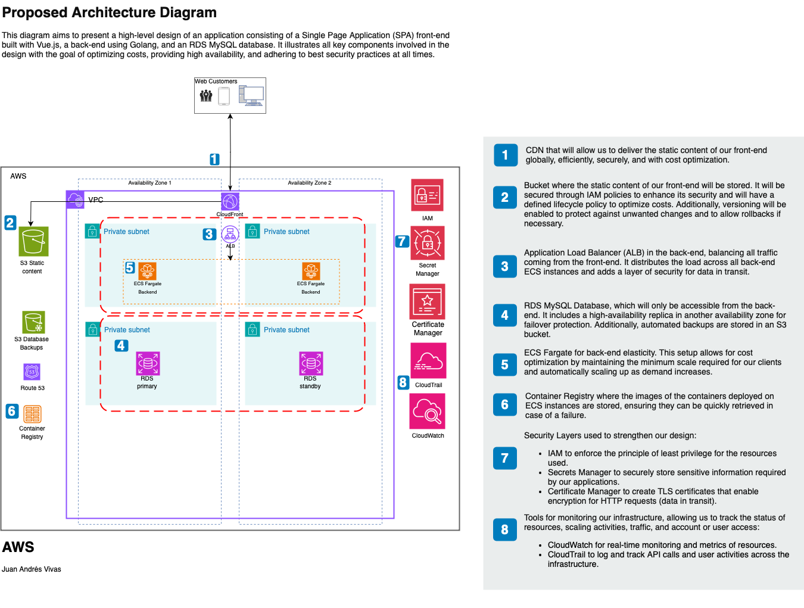

# AWS FT DevOps Challenge

This repository contains my proposal for the technical challenge. It includes two tasks: the first focuses on designing and diagramming an architecture with a front-end and back-end in AWS, emphasizing cost-efficiency, security, and high availability. The second task involves building a secure and scalable infrastructure using Terraform, followed by testing its availability and scalability.

I hope the proposal meets your expectations, and any feedback or suggestions for improvement are always welcome.


> "There's a better way to do - Find it."  
> — *Thomas Edison*
> 

## Table of Contents
- [AWS FT DevOps Challenge](#aws-ft-devops-challenge)
  - [Table of Contents](#table-of-contents)
  - [Task 1: High-Level Architecture](#task-1-high-level-architecture)
    - [1. High-Level Architecture Diagram](#1-high-level-architecture-diagram)
      - [Explanation of Components:](#explanation-of-components)
      - [Cost-Effectiveness Contributions:](#cost-effectiveness-contributions)
      - [Trade-offs Between Cost and Performance:](#trade-offs-between-cost-and-performance)
    - [2. Load Balancing and Auto-Scaling Strategies](#2-load-balancing-and-auto-scaling-strategies)
      - [AWS Services Utilized:](#aws-services-utilized)
      - [Cost Configuration:](#cost-configuration)
      - [Cost Implications:](#cost-implications)
    - [3. Security and Compliance Considerations](#3-security-and-compliance-considerations)
      - [Security Measures:](#security-measures)
      - [Cost Implications:](#cost-implications-1)
      - [Balance of Security and Cost-Effectiveness:](#balance-of-security-and-cost-effectiveness)
  - [Task 2: Automated Infrastructure with Terraform](#task-2-automated-infrastructure-with-terraform)
    - [1. Terraform Modules](#1-terraform-modules)
    - [2. Infrastructure Deployment](#2-infrastructure-deployment)
      - [Steps to Deploy:](#steps-to-deploy)

---

## Task 1: High-Level Architecture

### 1. High-Level Architecture Diagram

There are two main approaches for front-end architecture in a web application: Server-Side Rendering (SSR) and Single-Page Application (SPA). In the SSR approach, the server handles rendering dynamic HTML, which improves SEO and initial performance but requires more compute resources, increasing costs. On the other hand, the SPA approach shifts the workload to the client, allowing static content to be hosted on storage solutions like S3 and distributed globally via a CDN like CloudFront, optimizing costs and enhancing speed. The choice between these approaches depends on the application’s needs in terms of performance, SEO, and scalability.

- **Diagram with SSR**: 

- **Diagram with SPA**: 


#### Explanation of Components:
Each component in the architecture diagram is selected based on performance, cost-effectiveness, and scalability. Below is a breakdown of each component and why it was chosen:

- **Amazon ECS with Fargate**: A serverless container orchestration platform that runs containers without needing to manage servers. Fargate provides cost optimization by automatically scaling the required compute resources, ensuring pay-for-use, while also offering built-in security and isolation.

- **Amazon RDS MySQL with Standby Replica in Another AZ**: A managed MySQL database service designed for high availability and disaster recovery by automatically replicating data to a standby instance in a different Availability Zone (AZ). This ensures minimal downtime and enhances data durability, while optimizing cost through automated backups and on-demand scaling.

- **Amazon S3 for Static Website Content**: Provides durable and cost-effective storage for static web assets, such as images and JavaScript files, reducing the need for more expensive compute resources. Leveraging S3's high availability and regional redundancy ensures secure and scalable content delivery.

- **Amazon S3 for Database Backup**: Used for automated backup storage of RDS MySQL databases. It offers durable and secure storage with lifecycle policies to manage and minimize long-term storage costs, while ensuring rapid recovery in case of failure.

- **Amazon Elastic Container Registry**: A fully managed Docker container registry that integrates with ECS to store and manage container images. ECR optimizes costs by charging only for the storage and data transferred, while ensuring high security with IAM-based access controls.
  
- **Security Groups**: Virtual firewalls configured to tightly control inbound and outbound traffic to resources. By adhering to least-privilege principles, security groups ensure a secure environment while allowing flexibility and scalability.
  
- **IAM (Identity and Access Management)**: Used to enforce strict access controls across AWS resources, ensuring that only authorized entities can access sensitive data or make changes. This helps to minimize security risks while enabling efficient management of permissions at no additional cost.

- **AWS Certificate Manager (ACM)**: Simplifies the management and deployment of SSL/TLS certificates, ensuring that all public-facing endpoints are secured without incurring additional certificate costs. ACM automates certificate renewal, reducing the operational burden while enhancing security.

- **AWS Secrets Manager**: A managed service used to securely store, manage, and rotate sensitive information, such as database credentials, API keys, and other secrets. Secrets Manager integrates with backend and frontend services to provide secure access to sensitive data as needed, ensuring that these secrets are encrypted and automatically rotated to maintain security. This reduces the operational overhead of managing secrets while adhering to security best practices.
  
- **Amazon CloudWatch**: A monitoring service that tracks resource usage and performance metrics, enabling fine-tuning of infrastructure to optimize cost and performance. CloudWatch provides automated alerts and dashboards for real-time insights, helping to maintain availability and security.

- **AWS CloudTrail**: Logs and monitors API activity across AWS resources, ensuring full visibility into actions taken within the infrastructure. CloudTrail aids in compliance and forensic investigations, helping to secure the environment without adding complexity or cost overhead.

- **Application Load Balancer for Frontend and Backend**: ALB distributes traffic across multiple targets, ensuring high availability and scalability. A public-facing ALB is used for the frontend, while a private ALB secures backend services, optimizing network segmentation and reducing costs by minimizing unnecessary public exposure.

- **NAT Gateway**: Enables instances in private subnets to securely access the internet for software updates or external API calls, while preventing inbound traffic. Configured to minimize data transfer costs by strategically placing it in high-traffic AZs.

- **Amazon CloudFront for Frontend SPA**: A global content delivery network (CDN) that reduces latency and optimizes the delivery of static assets for the frontend SPA. CloudFront helps in lowering bandwidth costs while ensuring secure and fast content delivery through integrated SSL and edge caching.

- **Internet Gateway**: Is essential for enabling internet connectivity for resources in public subnets, ensuring that your backend and frontend services can interact with external systems when necessary.

- **Virtual Private Cloud**: Provides full control over the networking environment, including IP address ranges, subnets, routing tables, and gateways. It serves as the foundational networking layer for the infrastructure, ensuring that both public and private resources are segregated and secure.

- **Private Subnet**: A subnet within the VPC that is isolated from direct internet access, used for backend golang service and  database. Resources in a private subnet interact with the internet through a NAT Gateway for outbound requests while remaining secure from inbound traffic, ensuring cost-effectiveness and high security.

- **Public Subnet**: A subnet that allows direct internet access through an Internet Gateway (IGW). It would be used for frontend web servers or load balancers. Security groups ensure that only authorized traffic reaches the public resources, maintaining security.

#### Cost-Effectiveness Contributions:

- ECS Fargate: Optimizes costs by eliminating the need to manage servers and charges only for the compute resources actually used.
- RDS: Being fully managed, it reduces operational and maintenance costs, with the added benefit of automatic scaling.
- ALB: Enhances availability and stability while reducing costs by balancing traffic across multiple instances.
- S3 for static assets: Provides a low-cost, scalable storage solution, ideal for static files, especially when combined with CloudFront.
- CloudFront for SPA: Speeds up content delivery globally and reduces the load on backend servers, further optimizing costs.
  
#### Trade-offs Between Cost and Performance:
- Use ECS Fargate instances instead of EC2 or EKS to reduce costs by paying only for the resources used and saving on management overhead.
- ECS Fargate is advantageous because the Docker container gives us more flexibility if we later want to migrate the solution to a container orchestrator. However, if we wanted to optimize costs to the maximum, I would use AWS Lambda instead.
- Having a single database instance in one availability zone (AZ) reduces costs, although it may lead to downtime if that AZ becomes unavailable.
- Use S3 Glacier for database backups and apply a lifecycle policy with the minimum retention time to optimize costs, knowing that it may take longer to retrieve the data.
- Setting aggressive Fargate scaling policies (e.g., minimizing the number of running instances) could quickly affect performance if there are constant traffic spikes.
- Using a single availability zone reduces network costs at the expense of losing high availability in case of a failure.
  
---

### 2. Load Balancing and Auto-Scaling Strategies

- **Diagram**: [Link to Load Balancing and Auto-Scaling Diagram](#)

#### AWS Services Utilized:
- **Elastic Load Balancer (ELB)**: For distributing incoming traffic across multiple EC2 instances to ensure high availability.
- **Auto Scaling Groups (ASG)**: To dynamically scale EC2 instances based on traffic patterns, ensuring cost-efficiency.

#### Cost Configuration:
- Scaling policies are configured to optimize for low-demand periods by using spot instances and scaling out only during peak traffic times.
  
#### Cost Implications:
- Aggressive down-scaling policies help in keeping the costs low during periods of low traffic.
- By utilizing **AWS CloudWatch** to monitor performance metrics, auto-scaling triggers are fine-tuned to prevent unnecessary resource usage, thus controlling costs.

---

### 3. Security and Compliance Considerations

- **Diagram**: [Link to Security Diagram](#)

#### Security Measures:
- **VPCs with Subnets**: Segregation of public and private subnets to ensure that critical infrastructure is not exposed to the internet.
- **Security Groups**: Configured to restrict traffic to only necessary ports.
- **IAM Roles and Policies**: Least privilege access control to resources, ensuring minimal attack surface.

#### Cost Implications:
- **AWS Shield** (for DDoS protection) incurs additional costs but ensures compliance with security best practices.
- **Encryption with AWS KMS** introduces some overhead but is critical for ensuring data protection.

#### Balance of Security and Cost-Effectiveness:
- Managed services like **AWS WAF** provide security features that would otherwise require significant operational overhead, balancing cost and security needs.

---

## Task 2: Automated Infrastructure with Terraform

In this section, we build an automated AWS infrastructure using **Terraform** to ensure repeatable, scalable, and manageable deployment.

### 1. Terraform Modules

The project is modularized for ease of use and flexibility:
- **Modules**: [Link to Terraform Modules](./terraform/modules/)

Each module represents a critical part of the infrastructure, such as networking, compute, and storage. The modular approach simplifies the ability to make environment-specific adjustments.

### 2. Infrastructure Deployment

#### Steps to Deploy:
1. Clone the repository:
   ```bash
   git clone https://github.com/username/repository.git
   cd repository/terraform